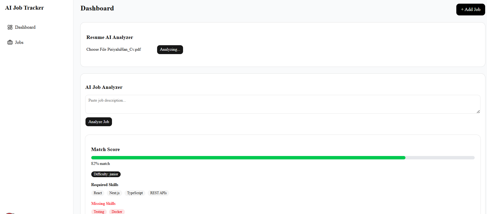

# AI Job Tracker

## About

AI Job Tracker is a modern Next.js application that helps job seekers manage their applications and use AI-powered tools to analyze job descriptions, compare resumes with job postings, and generate cover letters.

The app combines a clean user interface with database-backed job tracking and AI assistance to make it easier to stay organized and improve application success.

## Key features

- Save and track job applications with notes and status updates
- Analyze job descriptions using AI to identify required skills, difficulty level, missing skills, and match score
- Generate cover letters and improve resume matching with AI support
- Built with Next.js, Prisma, and OpenAI API integration
